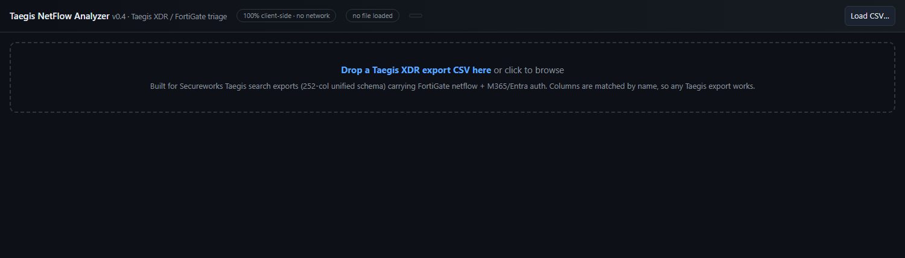
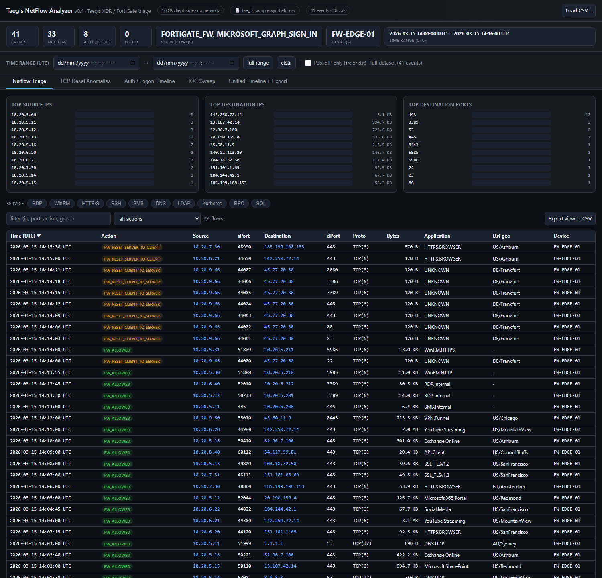
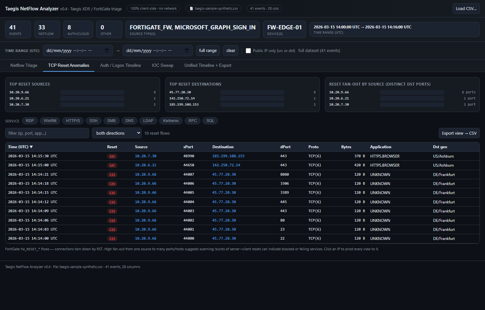
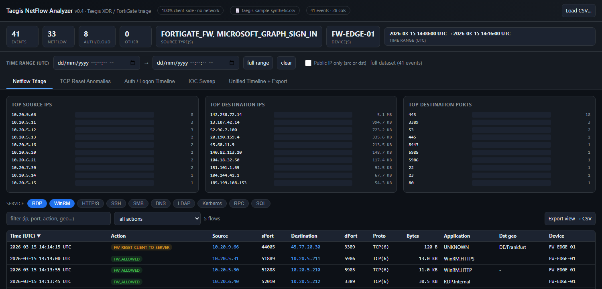

# Taegis NetFlow Analyzer

**Current build:** `Taegis-NetFlow-Analyzer-v0.4.html` (v0.4)

A single-file, **100% client-side** HTML tool for triaging **Secureworks Taegis XDR**
search exports — the 252-column normalized event schema that carries FortiGate
netflow, Microsoft 365 / Entra ID sign-ins, and other telemetry in one CSV.

No install, no server, no network calls. Open the HTML file in any browser and
drag a CSV onto it. Built for DFIR/IR workflows where evidence must never leave
the analyst's machine.

> **Important:** This tool contains no case data. Do **not** commit forensic
> exports (CSV/EVTX/PCAP/etc.) to this repo — the included `.gitignore` blocks
> common evidence file types as a guardrail.

## Screenshots

_All screenshots use the fully synthetic sample in [`sample/`](sample/) — every IP, user, and hostname is fabricated._

**Opening screen** — drag-and-drop a Taegis export:



**Netflow triage** — top talkers, bytes, ports, plus a filterable flow table:



**TCP reset anomalies** — `FW_RESET_*` flows with a per-source fan-out heuristic (here `10.20.9.66` hits 8 distinct ports — a scanning pattern):



**Service quick-filters** — one-click chips (RDP + WinRM active here) narrow the flow table to remote-access / lateral-movement ports:



## Features

- **Global time-range filter (UTC)** — a `From → To` range at the top filters
  **every** view at once. `datetime-local` inputs are interpreted as **UTC** to
  match the displayed event times; a **full range** button auto-fills the
  dataset's bounds.
- **Public IP only (src or dst)** — a global checkbox that, when ticked, keeps
  only rows where the source or destination is a routable public address.
  RFC1918, loopback, link-local (169.254/16), CGNAT (100.64/10), documentation,
  multicast, and reserved ranges are treated as non-public (basic IPv6 ULA /
  loopback / link-local handling included). Applies to every view.
- **Netflow triage** — top source/destination IPs, top destination IPs by bytes,
  top destination ports, with action / protocol / application columns and a
  filterable, sortable flow table.
- **Service quick-filter chips** — one-click toggles that narrow the Netflow and
  TCP-Reset tables to well-known service ports (match on source **or** destination
  port; multiple chips OR together): **RDP** (3389), **WinRM** (5985/5986),
  **HTTP/S** (80/443/8080/8443/8000), **SSH** (22), **SMB** (445/139), **DNS** (53),
  **LDAP** (389/636/3268/3269), **Kerberos** (88), **RPC** (135), **SQL**
  (1433/3306/5432/1521). Great for hunting remote-access and lateral movement.
- **TCP reset anomalies** — isolates FortiGate `FW_RESET_*` flows (connections
  torn down by RST), with top reset sources/destinations, a **fan-out heuristic**
  (distinct destination ports per source — a scanning indicator), and a
  direction filter (client→server / server→client resets).
- **Auth / logon timeline** — `auth` + `cloudaudit` events (M365 / Entra sign-ins)
  with user, source IP, result, **MFA result**, and application.
- **IOC sweep** — paste or load a list of IPs, CIDRs, and domains; matched events
  are highlighted across every view (CIDR-aware matching).
- **Unified timeline + export** — all event types merged on one UTC timeline with
  free-text filtering, CSV export of the current view (named after the loaded
  file), and a "copy for case notes" button.

The loaded CSV's filename and the tool name/version are shown in the header and
footer of the page.

## Usage

1. Open `Taegis-NetFlow-Analyzer-v0.4.html` in a browser (double-click), or grab
   it from the [Releases](../../releases/latest) page.
2. Drag a Taegis XDR export CSV onto the drop zone (or click **Load CSV…**).
3. Use the tabs to triage. Click any IP to filter all views to it. Set a
   **Time range (UTC)** at the top to scope every view to a window.

Want to try it without real data? Load the included
[`sample/taegis-sample-synthetic.csv`](sample/taegis-sample-synthetic.csv) — a
small, fully fabricated dataset (netflow, a reset "scan", and M365 sign-ins).

## Why a dedicated parser

Two characteristics of Taegis exports break naive CSV handling (Excel, simple
comma-splitting):

- **Embedded JSON** — several columns (`original_data`, `ingest`, `*_ipgeo_summary`,
  `event_metadata`, …) contain JSON with commas and quotes. The tool uses a proper
  RFC-4180 parser that respects quoted fields, `""` escapes, and embedded newlines.
- **`*_usec` columns are ISO-8601 strings** — despite the `_usec` suffix,
  `event_time_usec`, `start_timestamp_usec`, etc. hold strings like
  `2026-06-21T09:59:57Z`, not microsecond integers. The parser handles both forms.

Columns are resolved **by header name**, so the tool works on any Taegis XDR
search export, not just netflow/VPN pivots.

## Field mapping notes

| Concept | Taegis column(s) used |
|---|---|
| Event time | `event_time_usec` → `start_timestamp_usec` → `created_time_usec` → … |
| Event class | `type` (`netflow` / `auth` / `cloudaudit` / …) |
| Netflow action | `flow_action` (e.g. `FW_ALLOWED`, `FW_RESET_*`) |
| Source / dest | `source_address` / `destination_address` (+ `source_nat_address` for public NAT) |
| Bytes / packets | `tx_byte_count` + `rx_byte_count` / `tx_packet_count` + `rx_packet_count` |
| Device / sensor | `sensor_id`, `sensor_type` |
| Auth user | `user_name` → `target_user_name` → `extra_userprincipalname` → … |
| MFA | `mfa_result`, `mfa_used` |

## Releasing

Releases attach the standalone HTML file so it can be downloaded without cloning.
Cut a new one with the helper:

```sh
./release.sh v0.4                 # auto-picks the newest Taegis-NetFlow-Analyzer-*.html
./release.sh v0.4 path/to.html    # or name the asset explicitly
```

Equivalent manual command:

```sh
gh release create v0.4 Taegis-NetFlow-Analyzer-v0.4.html \
  --title "Taegis NetFlow Analyzer v0.4" --notes "…"
```

Downloads live at `https://github.com/bpmorris22/taegis-xdr-analyzer/releases/latest`.

## License

MIT — see [LICENSE](LICENSE).
